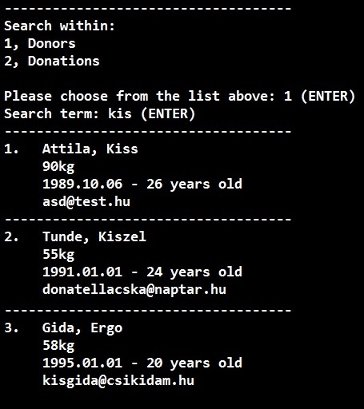

# Persist donor

## Description:

After the user typed in the data of a donor, the program should store the data in a file. The file format should be CSV (Comma Separated Value), where the values are separated with a comma. If a field contains comma then field should be bounded with quotation marks.
For more information click on the link at the bottom.
Take care of storing EVERY field of the donor, because the program should be able to restore the previously stored fields!
When a field is empty, store an empty field.
Something like this:
Kandisz Nóra,1990.09.10.,123456AB,,,"Régiposta u. 9. , Fsz/1",,

--------------

## Acceptance criteria:

* Add donor is available from main menu
* After enter all necessary data that is appended to the previous stored **donors.csv**
* The **donors.csv** file should be in a separated folder named: "**Data**"

--------------

Order: 1

--------------

[donor_sample.csv](donor_sample.csv)

Donor sample

--------------

https://en.wikipedia.org/wiki/Comma-separated_values

---------------------------------------
---------------------------------------

# Persist donation

## Description:

After the user typed in the data of a donation event, the program should store the data in a file. The file format should be CSV (Comma Separated Value), where the values are separated with a comma. If a field contains comma then field should be bounded with quotation marks.
For more information click on the link at the bottom.
Take care of storing EVERY field of the donation event, because the program should be able to restore the previously stored fields !
When a field is empty, store an empty field.
Something like this:
Miskolc,2015.12.01,,,,"Régiposta u. 9. , Fsz/1",,

---------------

## Acceptance criteria:

* Add doantion is available from main menu
* After enter all necessary data that is appended to the previous stored **donations.csv**
* The **donations.csv** file should be in a separated folder named: "**Data**"

---------------

Order: 2

--------------

[donations_sample.csv](donations_sample.csv)

Donation sample

--------------

https://en.wikipedia.org/wiki/Comma-separated_values

----------------------------------------
----------------------------------------

# Basic menu

## Description:

As a user I want to able to choose my next action from a menu. The menu should look like this:

1. Add new donor
2. Add new donation event
3. Delete a donor
4. Delete a donation event
5. List donors or donation events
6. Search
7. Exit


When the user types in a number (1-7) and presses enter the screen should be cleared and chosen function should run.

* Add new donor: the program should get the neccessary data from user via console. If the donor is ready for donation, the program should store the given values. When persistence is done the program should return to the main menu screen.
* Add new donation event: the program should get the neccessary data from user via console. After all values are given the program should store the given values. When persistence is done the program should return to the main menu screen.
* Delete a donor: the program should get the unique identifier or passport number of the donor. After the program deleted the donor with the given identifier, it should return to the main menu screen.
* Delete a donation event: the program should get the unique identifier of the donation event. After the program deleted the donation event with the given identifier, it should return to the main menu screen.
* List donors or donation events: chosing this menu item a new menu screen should be appeared where the user can choose if he/she would like to list donors (1) or donation events (2) or can cancel (0) the operation and return to the main menu screen. When user chose list donors the program should list all the previously stored donors. It is similar to list donation events.

------------------

## Acceptance criteria:

* add new donor
* add new donation event
* delete a donor
* delete a donation event
* list donors or donation events
* search in donors or donations
* in the sub menu there is a possibility to go back to the main menu
* after add/delete actions the system go back to the main menu
* after list and search actions there is a possibility to go back to the main menu

---------------------

Order: 3

--------------------------------------
--------------------------------------

# Delete donor

## Description:

As a user I want to have a menu item in the application to be able to delete any donor. I want to use the attribute to delete the selected one that handled as a unique identifier. In case of missing or wrong ID I want to know I have to correct the given input to search. In that case the corresponding error message is visible. I want to have a feedback about the executed deletion. If it was possible then a notification is necesseary. Please keep in mind the storage file do not store the deleted data after the deletion.

---------------------

## Acceptance criteria:

* The donor with given ID is deleted when I chose the corresponding menuitem and type the ID to delete.
* The storage file is up-to-date.
* I have feedback message to be sure the state of the execution of the deletion.
* When I can not delete because of any reason I want to get back to the main menu.

---------------------

Order: 4

---------------------------------------
---------------------------------------

# Delete donation

## Description:

As a user I want to have a menu item in the application to be able to delete any donation. I want to use the attribute to delet the selected one that handled as a unique identifier. In case of missing or wrong ID I want to know I have to correct the given input to search. In that case the corresponding error message is visible. I want to have a feedback about the executed deletion. If it was possible then a notification is necesseary. Please keep in mind the storage file do not store the deleted data after the deletion.

-----------------

## Acceptance criteria:

* The donation with given ID is deleted when I chose the corresponding menuitem and type the ID to delete.
* The storage file is up-to-date.
* I have feedback message to be sure the state of the execution of the deletion.
* When I can not delete because of any reason I want to get back to the main menu.

-----------------

Order: 5

---------------------------------------
---------------------------------------

# List donor / donation

## Description:

As a user I want to have a List menu in the application. When the list menu is selected I want to have a question to select the "DONOR" or "DONATION" to list. Every donor or donation is listed to the console. Please keep in mind print only the amount of donor or donation that is readable in the screen. Add the opportunity to page to next page.

```
-------------------------------------------
Bela, Kiss
90kg
1995.01.01 - 20 years old
[email protected]
-------------------------------------------
```

-------------------

## Acceptance criteria:

I can succesfully list the donors or donations from the storage file to the screen.
I can page the donors or donations if cannot be listed out in one screen alltogether.
If the list is empty the user should be informed.
The printing should be structured in the given form.

------------------

Order: 6

-------------------------------------------
-------------------------------------------

# Search

## Description:

As a user I want to have a **Search** menu in the application. When the search menu is selected I want to have a question to select the "DONOR" or "DONATION" to search. Every donor or donation from the result is listed to the console. Search should be like search everywhere so in every field of the items (name, email, age). Please keep in mind print only the amount of donor or donation that is readable in the screen. Add the opportunity to page to next page.



---------------------

## Acceptance criteria:

* Entering into the search menu the screen should be cleared (see attachment)
* I can succesfully search the donors or donations from the storage file to the screen.
* All the donors or donations should be listed which contain the term in any field.
* I can page the donors or donations of the result if cannot be listed out in one screen alltogether.
* If the result list is empty the user should be informed.
* The printing should be structured in the given form.
* The result items should start with an order
* All result item should be separated with a line

------------------

Order: 7

---------------------------------------------
---------------------------------------------

# Extend list with order by

## Description:

As a user I want to be able to give a field as an order by clause when I choose **list** menu item. After I type it from an option list the result should be sorted ascendantly according to the choosen field. If I didn't choose any field (only hit ENTER) the result should be sorted by

* Name in case of Donors
* Date of event in case of Donation
  by default.

---------------------

## Acceptance criteria:

* The option list appeared after chose List
* By default the result sorted by Name in case of Donors
* By default the result sorted by Date of event in case of Donations
* If I chose a concrete field the result should be sorted according to that

--------------------

Order: 8

---------------------------------------------
---------------------------------------------

# Actual menu item background color

## Description:

As a user I want to see more visualization in the menu. I don't want to enter a number for select a menu item. I want it to be more comfortable just stepping between menu items with the up/down cursor keys. I want to see which menu item is selected before I choose it so the current menu item should has white background and black font color.

-------------------

## Acceptance criteria:

* Menu is still funcational
* If I press up key the menu item above becomes selected 
* When I stand on the first item than the selection doesn't change on pressing up
* If I press down key the menu item below becomes selected
* When I stand on the last item than the selection doesn't change on pressing down
* By default the first menu item is selected

-------------------

Order: 9

----------------------------------------------
----------------------------------------------

# What we have done

Our work can be fing under tag [*Week5B*](https://github.com/KoicsD/CharliesAngels/tree/Week5B) with date 16th Nov. We had 7 days for work instead os 5, as there was not enough time for listening to all the SCRUM-groups on Friday that week -- fortunatelly, as we needed this extra time.  
As I had a lot of idea about arranging and refactoring our code, I created some branches outside [*master*](https://github.com/KoicsD/CharliesAngels/tree/master) for experimental purposes.
You can read about them [here](https://github.com/KoicsD/CharliesAngels/blob/master/TaskDescription/OutsideMaster.md).

-----------------

## What we undertook from tasks and what we implemented

### What we undertook:
* file reading and writing
* deleting *Donors* and *Donation* events
* a basic lister function
* basic menu for above points

### What we implemented:
* file handling (using [*csv* module](https://docs.python.org/3/library/csv.html?highlight=csv#module-csv))
* deleting *Donors* and *Donation* events
* listing without sorting -- different style in case of *Donors* and *Donation* events
* searcher function for *Donors*
* basic menu for all above points (with [OOP](https://en.wikipedia.org/wiki/Object-oriented_programming) point of view)
* we made possible to leave the field *"Date of Last Donation"* empty when entering new *Donor*

### Bugs we made:
* identity number of *Donation* events "slipped" when deleting an event  
* there were no way to read the unique identifier of *Donor*s when listing  
* our lister was able to list only one *Donor* or *Donation* at a time, so we did not have to bother about paging  
  -- we have not implemented page-size watcher and pager since than at all

------------------

## Structure of code

### Handling *Donation* events:
While class-definition of *Donation* objects is in module [*event_reg*], *Donation* objects themselves are stored in a list in a new module named [*data_handler*].
This module is responsible for storing them into and loading them from [*csv* file], using [*csv* module].

### Handling *Donors*:
Since our code has no class-definition for *Donor* objects, the above point of view cannot be used.
Hence, module [*donor_reg*] uses a new module, named [*donor_csv_writer*] to store the data got from user to [*csv* file].
Listing and searching is done by new, separate modules ([*List_donors*] and [*search_in_files*]), and all of them are imported into [*data_handler*], which forwards control from main menu to them.
All the file-handler modules use [*csv* module] and there are no global lists of *Donor* data in our code.

### Object-oriented menu:
Menu got a [separate module] of general class-definitions. There are 3 classes to be mentioned:
* *MenuItem* -- the parent of the two other classes below
* *Menu* -- this has a list of further *MenuItem*s, this *MenuItem*s are listed on screen when method *load* is called
* *MenuPoint* -- this has a function delegate of a predefined function and invokes this function when method *load* is invoked

The above classes are instantiated in [*main* module] when application is started up.
When startup is ready, a while-True loop invokes the method *load* of global variable *main_menu* repeatedly.
This loop gives the base of our application.

In a phase of developement our menu supported arrow keys as well, but later this feature was reverted as it was unable to cooperate with our [IDE](https://en.wikipedia.org/wiki/Integrated_development_environment), [*PyCharm*](https://www.jetbrains.com/pycharm/).
(See also delta of [commit "menu reverted to regain platform independence"](https://github.com/KoicsD/CharliesAngels/commit/abcbe272c07948452c9ea5182c75dde8cccf1c27) and browse files of [commit "footnote instructions added to menu"](https://github.com/KoicsD/CharliesAngels/commit/de418fea998d2e4f1381661f8bb39dee4dbe5ff9))

### Module Files:  
To summarize, our application consisted of (and still contains) the following files:  
* [*data_handler.py*]  
  Database module. This module handles *Donation* objects and delegates control to modules handling *Donors*.  
* [*delete_donor.py*]  
  This file is responsible for asking a *Donor* ID and deleting *Donor*.  
* [*donor_csv_writer.py*]  
  Module *donor_reg* use this module to append inputted data to [*csv* file](https://en.wikipedia.org/wiki/Comma-separated_values).  
* [*donor_reg.py*]  
  This module is responsible for inputting new *Donor*'s data.  
* [*event_reg.py*]  
  This module contains the class definition of *Donation* objects.  
* [*List_donors.py*]  
  This module is responsible for listing *Donors*.  
* [*main.py*]  
  This is the entry point.  
  Its function *initialize* instantiates classes of module *menu*
  -- storing the function delegates of module *data_handler* in the new menu-objects.  
  The heart of our application is a while-True loop in *main* function
  which invokes the *load* method of object *main_menu* repeatedly
  until user hits the quit option and function *shutdown* is invoked.  
* [*menu.py*]  
  This module contains general class-definitions for menu systems.  
* [*search_in_files.py*]  
  This module is responsible for searching in *Donors*.
  It asks user for a search key and searches in *Donor*'s file.

### Experimental Files:
The following files were created for making expirements but they are no parts of our application:
* [*delete_in_files.py*]  
  This was [Zoltán Székely](https://github.com/Szezol)'s expirement on deleting *Donors* using an assistant file.  
* [*donor_writer.py*]  
  [Gergely Viczmándi](https://github.com/viczmandi) created this file but he left it empty.  
* [*sort_the_list_by_order.py*]  
  This was an expirement to implement ordered sorting of *Donors*.

--------------------------

## Bug: "Slip" of *Donation* events in database on deletion

blabla

--------------------------

## Lack of [unit-tests](https://docs.python.org/3/library/unittest.html?highlight=unittest#module-unittest)

blabla

----------------------------------------------
----------------------------------------------

# What we have learnt

blabla

----------------------------------------------
----------------------------------------------

[Next: Week6](OrdersWeek6.md)  
[Previous: General](InitialOrder.md)  
[Back to README](../README.md)
